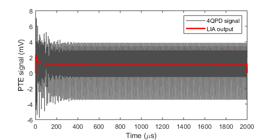
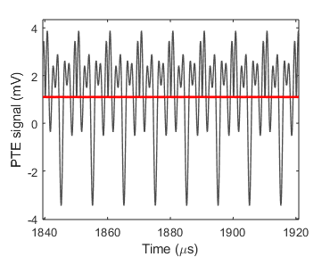

A small program I wrote to theoretically simulate the output signals originating from transient repetitive heating (and cooling) of a sample underneath an AFM tip when an ultrafast laser shines on it.
Here are some sample results, also found in the *Results* folder:

This is the simulated lock-in amplifier signal vs. time:

And a zoomed view to late times, at which steady state is reached:

use an '<addr>'
